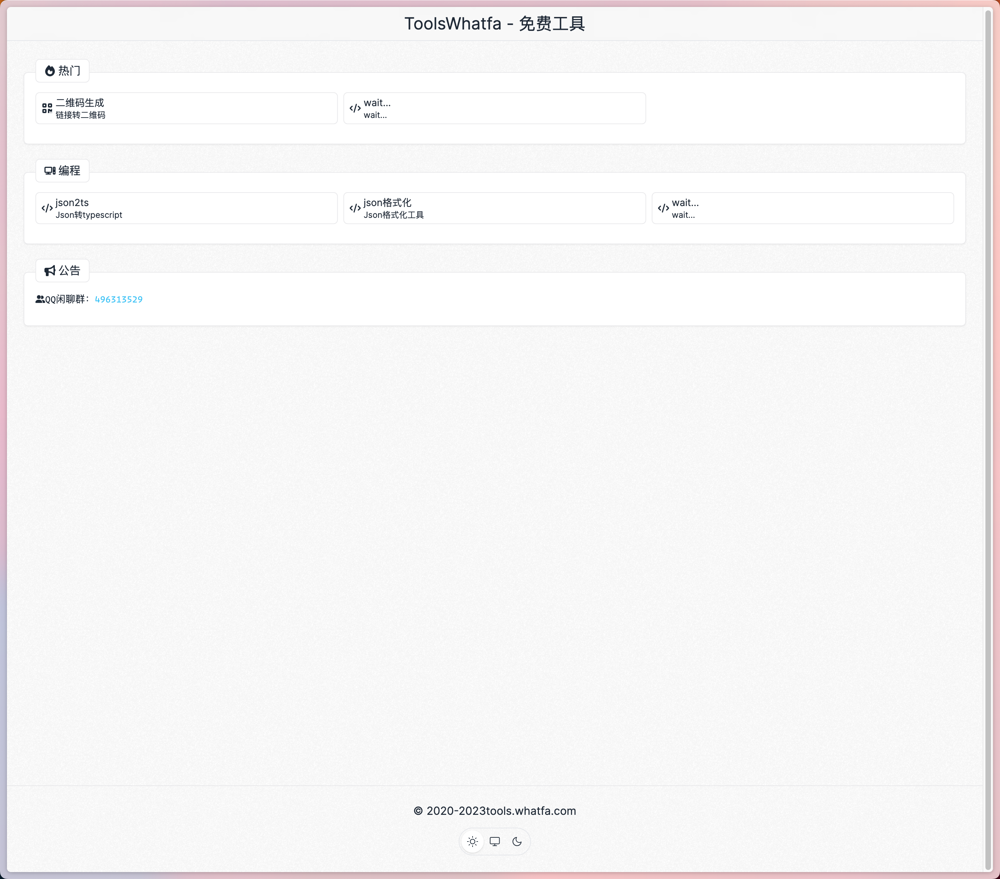

# ToolsWhatfa 在线免费工具

## screenshots

### PC




### mobile


## Getting Started

First, run the development server:

```bash
npm run dev
# or
yarn dev
# or
pnpm dev
```

## update version

run command:

```bash
pnpm version patch
# or
npm version patch

```

## TODO

wait list

- [x] page keywords
- [x] github icon
- [ ] feedback
- [ ] friends' links
- [ ] Image compression
